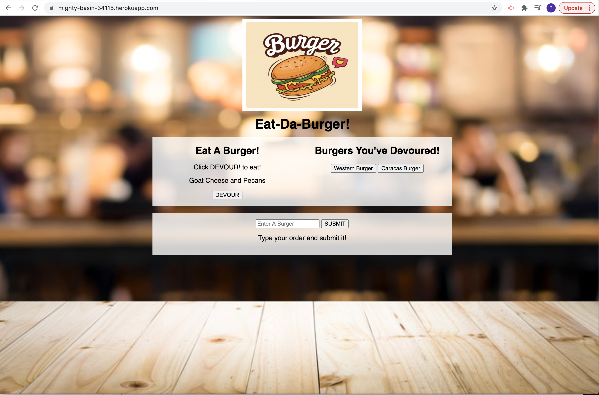

# eat-da-burger

## Table of Content: 
#### (Link to Github Repo) [https://github.com/mazzeiroman/eat-da-burger]
- [Description](#description)
- [Installation](#installation)
- [Usage](#usage)
- [Contributing](#Contributing)
- [Tests](#tests)
- [License](#license)
- [Questions](#Questions)
- [Credits](#credits)

## Link to Github Repo
https://github.com/mazzeiroman/eat-da-burger

## Link to the Deployed Application
 https://mighty-basin-34115.herokuapp.com/

 

## Description
 A burger logger with MySQL, Node, Express, Handlebars and a homemade ORM (yum!). Following the MVC design pattern; using Node and MySQL to query and route data in the app, and Handlebars to generate HTML.
 
## Installation 
 You must install node.JS, the Inquirer Package, mysql package, express, express-handlebars, you must also install MySQL and MySQL Workbench.

## Usage
 A simple application that allows the user to create a burger, click a button and add it to a database, dynamically creating an HTML file and displaying the information to the user. 

## Contributing
 Roman Mazzei

## Tests
 None

## License
       MIT
  
## Questions
For any questions you can find me on Github or through my E-mail:
      
> GitHub https://github.com/mazzeiroman

> E-mail: mazzeiroman@gmail.com
      
### Credits
© 2020 Roman Mazzei.      
      